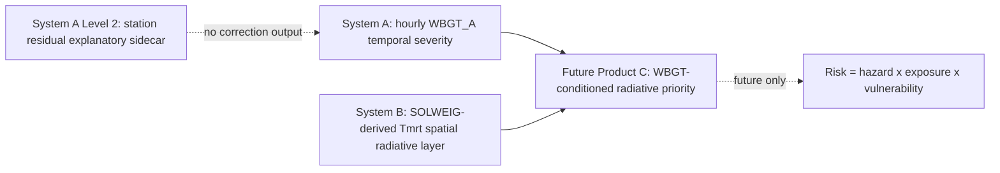

# OpenHeat System A + System B 全量开发日志与新聊天交接

生成日期：`2026-05-28`  
当前 lane：`OPENHEAT_DEVLOG_2026_05_28`  
项目身份：A WBGT-gated, SOLWEIG-informed, surrogate-assisted local heat hazard ranking prototype for Toa Payoh, Singapore.

## 1. 顶层摘要

| 项目 | 当前值 |
| --- | --- |
| 主工作区 | `C:\Users\CloudStar\Documents\GitHub\Urban-Analytics-Portfolio\06-openheat_grid_b8\06-openheat_grid` |
| git root | `C:/Users/CloudStar/Documents/GitHub/Urban-Analytics-Portfolio/06-openheat_grid_b8` |
| 当前分支 | `codex/b87g0-source-breakthrough-attempt` |
| git status -sb -uno | `## codex/b87g0-source-breakthrough-attempt` |
| 当前工作区短状态 | `?? configs/v12/openheat_devlog_2026_05_28.yaml
?? configs/v12/systemb_b87g0_source_breakthrough_attempt.yaml
?? docs/handoff/OpenHeat_ACTIVE_DEV_BOARD_2026-05-28.md
?? docs/handoff/OpenHeat_NEW_CHAT_REENTRY_CONTEXT_2026-05-28_CN.md
?? docs/handoff/OpenHeat_NewDevRoadmap_Framework_2026-05-27_CN.md
?? docs/handoff/OpenHeat_SystemA_SystemB_FULL_DEVLOG_2026-05-28_CN.md
?? docs/roadmap/
?? docs/v12/OpenHeat_SystemB_B87G0_source_breakthrough_attempt_CN.md
?? outputs/devlog_2026_05_28/
?? outputs/v12_surrogate/b87g0_source_breakthrough_attempt/
?? scripts/v12_b87f2_common.py
?? scripts/v12_b87f_common.py
?? scripts/v12_b87g0_closure_note.py
?? scripts/v12_b87g0_comparison_audit.py
?? scripts/v12_b87g0_connected_shade_graph_builder.py
?? scripts/v12_b87g0_external_source_feasibility.py
?? scripts/v12_b87g0_feature_patch_builder.py
?? scripts/v12_b87g0_input_inventory.py
?? scripts/v12_b87g0_leakage_audit.py
?? scripts/v12_b87g0_model_registry.py
?? scripts/v12_b87g0_promotion_stopgo.py
?? scripts/v12_b87g0_run_source_breakthrough_attempt.py
?? scripts/v12_b87g0_source_discovery.py
?? scripts/v12_b87g0_train_evaluate.py
?? scripts/v12_b87g0_tree_building_interaction_builder.py
?? scripts/v12_devlog_build_handoff.py
?? scripts/v12_devlog_inventory.py
?? scripts/v12_devlog_run.py
?? scripts/v12_devlog_summarize_lanes.py` |
| 缺失或不可读证据数 | `1` |

核心边界：本项目当前仍是 WBGT-gated、SOLWEIG-informed、surrogate-assisted 的 Toa Payoh 本地热危害排序原型。本文不把任何输出升级为本地 100m WBGT、官方预警概率、AOI/B9 推理、风险图、观测真值或 System A/B 已耦合产品。System A 与 System B 是不同层。

## 2. 架构对齐

| 层 | 当前解释 | 禁止升级 |
| --- | --- | --- |
| System A Level 1 | `wbgt_a_c` 是冻结主输出；P_ge31、期望超阈值、区间是可选诊断伴随列 | 本地 100m WBGT、官方预警概率 |
| System A Level 2 | 站点残差解释性侧车，弱高尾信号，score residual 不可识别 | station-adjusted WBGT、因果修正 |
| System B | SOLWEIG 模拟 Tmrt / `delta_tmrt_p90_c` 空间辐射层和 surrogate 检查点 | Tmrt=WBGT、AOI/B9、风险图 |
| Product C | 未来 WBGT-conditioned radiative priority | 当前不得声称已耦合 |
| Risk | 未来 hazard x exposure x vulnerability | 当前未开始 |

## 3. System A 总览

最终解释：Level 1 deterministic `wbgt_a_c` 是冻结主输出；`p_ge31_optional`、expected exceedance、conformal/interval diagnostics 只能作为可选诊断伴随列；`p_ge33_optional` 仍是探索性。A-L1H.6 等正式快照；A-L1H.7 等真实正式输入；A-L1H.8 dossier pass / frozen handoff。Level 2 仅解释性侧车。

| lane | status | class | result | next |
| --- | --- | --- | --- | --- |
| A-L1H.0 | PASS_DIAGNOSTIC / not_declared_in_status_file | DIAGNOSTIC | Observed ge31 rows in residual report: 408; predicted ge31 rows: 290; M4 fixed_31 recall 0.475 and precision 0.669 in integration report; Full-period weather merge matched 816/816 observed ge31 rows | No action unless reopening a separately scoped diagnostic review. |
| A-L1H.1 | PASS / WEAK_OR_NEGATIVE | DIAGNOSTIC | Best diagnostic candidate max_pred=29.777 C; Best diagnostic candidate MAE=1.359 C; Best-F1 ge31 threshold=27.05 C | No contract change. |
| A-L1H.2 | PASS_CANDIDATE_PROBABILITY_COMPANION | DIAGNOSTIC | Brier=0.052; PR-AUC=0.610; ECE_fixed=0.018 | Feed A-L1H.4 companion suite and A-L1H.5 contract. |
| A-L1H.3 | PASS / RECALL_FIRST_DIAGNOSTIC | DIAGNOSTIC | Delta recall vs current best_F1=0.088; Delta miss_rate=-0.088; Delta precision=-0.031 | Proceed to companion suite/contract, not A-L2 unless separately scoped. |
| A-L1H.4 | A_L1H4_COMPANION_PROMISING | ACCEPTED_WITH_BOUNDARY | n=1674 ge31=204 ge33=15; P_ge31 Brier=0.052 ECE_fixed=0.018 PR-AUC=0.610; best_F1 recall 0.765 precision 0.678 miss_rate 0.235 | Use as evidence for A-L1H.5 output contract and future A-L1H.6 snapshot evaluation. |
| A-L1H.5 | A_L1H5_CONTRACT_PASS | ACCEPTED_FROZEN | WBGT_A MAE=0.639 C; P_ge31 events=204 Brier=0.052 PR-AUC=0.610; P_ge33 events=15 low support | Do not modify unless a future formal snapshot review explicitly opens a contract update lane. |
| A-L1H.6 | A_L1H6_WAITING_FOR_FORMAL_SNAPSHOT | BLOCKED_WAITING | P_ge31 gate remains P_GE31_REMAINS_OPTIONAL_WAITING; P_ge33 remains exploratory | Rerun only after A-L1H.7 freezes a reviewed formal snapshot. |
| A-L1H.7 | A_L1H7_WAITING_FOR_FORMAL_INPUT | BLOCKED_WAITING | Current schema status WAITING_NO_FORMAL_SCHEMA_CANDIDATE; Minimum support required: 200 prospective rows, 30 ge31 events, 30 ge33 events for promotion review | Provide reviewed compact formal candidate; run write_snapshot; then run A-L1H.6. |
| A-L1H.8 | A_L1H8_DOSSIER_PASS | ACCEPTED_FROZEN_HANDOFF | Dossier status A_L1H8_DOSSIER_PASS; Formal snapshot status WAITING; P_ge31 optional diagnostic companion | Future re-entry starts with A-L1H.7 only when a real formal snapshot exists. |
| A-L2.0 | PASS | DIAGNOSTIC | context-adjusted residual stable stations=14; high-tail stable stations=8; challenger probability-error stable stations=1 | Proceed only to A-L2.1 scoped station features/preflight. |
| A-L2.1a | PASS_FEATURE_TABLE | DIAGNOSTIC | Station count=27 | Feed A-L2.1b QA. |
| A-L2.1b | PASS_FEATURE_QA_READY_FOR_SCOPED_MODEL | DIAGNOSTIC | S142 n_ge31=15 high_tail=2.239617; S139 n_ge31=1 low support | A-L2.1c scoped residual preflight. |
| A-L2.1c | A_L2_SCOPED_SIGNAL_PROMISING | EXPLANATORY_ONLY | high-tail residual MAE 0.4035 vs null 0.4316; high-tail improvement about 6.5%; p_mae=0.0529 p_spearman=0.0250 | Only future explanatory protocol after longer archive and better metadata/SVF/LCZ/siting. |

### A-L1H.0 high-tail residual decomposition

| field | value |
| --- | --- |
| 状态 | PASS_DIAGNOSTIC / not_declared_in_status_file |
| 分类 | DIAGNOSTIC |
| 分支 | not recorded; evidence in sibling_al1h codex/systema-development-dossier |
| 目的 | Diagnose WBGT_A high-tail compression, station bias, ge31 miss/hit/false-alarm behavior, and weather-regime context. |
| 记录命令 | recorded in predecessor lane outputs; no command rerun for devlog |
| 配置 | configs/v11/systema_l1h_residual_decomposition.yaml; configs/v11/systema_l1h_weather_regime_merge.yaml; configs/v11/systema_l1h_full_period_weather_merge.yaml |
| 脚本 | scripts/v11_l1h_run_residual_decomposition.py; scripts/v11_l1h_run_weather_regime_merge.py; scripts/v11_l1h_run_full_period_weather_merge.py |
| 文档 | docs/v11/OpenHeat_SystemA_L1_high_tail_residual_decomposition_protocol_CN.md; docs/v11/OpenHeat_SystemA_L1H_weather_regime_residual_merge_CN.md; docs/v11/OpenHeat_SystemA_L1H_full_period_weather_merge_CN.md |
| 输出目录 | outputs/v11_systema_l1_high_tail/residual_decomposition |
| 关键输出 | outputs/v11_systema_l1_high_tail/residual_decomposition/high_tail_bias_report.md; outputs/v11_systema_l1_high_tail/residual_decomposition/residual_by_station.csv; outputs/v11_systema_l1_high_tail/weather_regime_merge_full_period/A_L1H_0C_STATUS.md |
| 关键发现 | High-tail compression around ge31 was visible.; S142 station bias was a prominent caveat.; Weather-regime diagnostics supported review context but not causal proof. |
| 量化结果 | Observed ge31 rows in residual report: 408; predicted ge31 rows: 290; M4 fixed_31 recall 0.475 and precision 0.669 in integration report; Full-period weather merge matched 816/816 observed ge31 rows |
| 接受结论 | Use as historical diagnostic context for Level 1 high-tail behavior only. |
| 注意事项 | Not a recalibration lane.; ge33 rows exploratory.; Weather regime is diagnostic, not causal. |
| 禁止表述 | validated local 100m WBGT; official warning probability; prospective forecast skill |
| 下一步 | No action unless reopening a separately scoped diagnostic review. |
| 重入命令 | not_applicable |

### A-L1H.1 formula/proxy audit

| field | value |
| --- | --- |
| 状态 | PASS / WEAK_OR_NEGATIVE |
| 分类 | DIAGNOSTIC |
| 分支 | not recorded |
| 目的 | Audit raw formula/proxy alternatives as a companion check, not retroactive recalibration. |
| 记录命令 | python scripts/v11_l1h_run_formula_proxy_audit.py --config configs/v11/systema_l1h_formula_proxy_audit.yaml |
| 配置 | configs/v11/systema_l1h_formula_proxy_audit.yaml |
| 脚本 | scripts/v11_l1h_formula_proxy_audit.py; scripts/v11_l1h_run_formula_proxy_audit.py |
| 文档 | docs/v11/OpenHeat_SystemA_L1H_formula_proxy_audit_CN.md |
| 输出目录 | outputs/v11_systema_l1_high_tail/formula_proxy_audit |
| 关键输出 | outputs/v11_systema_l1_high_tail/formula_proxy_audit/A_L1H_1_STATUS.md; outputs/v11_systema_l1_high_tail/formula_proxy_audit/formula_overall_metrics.csv; outputs/v11_systema_l1_high_tail/formula_proxy_audit/formula_threshold_metrics_31_33.csv |
| 关键发现 | Formula/proxy candidates stayed weak or negative versus WBGT_A.; Best raw formula remained a screening diagnostic. |
| 量化结果 | Best diagnostic candidate max_pred=29.777 C; Best diagnostic candidate MAE=1.359 C; Best-F1 ge31 threshold=27.05 C |
| 接受结论 | Do not replace or retroactively recalibrate WBGT_A with formula/proxy candidates. |
| 注意事项 | Screening diagnostics only.; ge33 remains exploratory. |
| 禁止表述 | formula-v2 implemented; validated replacement model; retroactive recalibration |
| 下一步 | No contract change. |
| 重入命令 | python scripts/v11_l1h_run_formula_proxy_audit.py --config configs/v11/systema_l1h_formula_proxy_audit.yaml |

### A-L1H.2 probability / threshold calibration

| field | value |
| --- | --- |
| 状态 | PASS_CANDIDATE_PROBABILITY_COMPANION |
| 分类 | DIAGNOSTIC |
| 分支 | not recorded |
| 目的 | Create a retrospective station-held-out P_ge31 diagnostic companion from existing M4 scores. |
| 记录命令 | python scripts/v11_l1h_run_probability_threshold_calibration.py --config configs/v11/systema_l1h_probability_threshold_calibration.yaml |
| 配置 | configs/v11/systema_l1h_probability_threshold_calibration.yaml |
| 脚本 | scripts/v11_l1h_probability_threshold_calibration.py; scripts/v11_l1h_run_probability_threshold_calibration.py |
| 文档 | docs/v11/OpenHeat_SystemA_L1H_probability_threshold_calibration_CN.md |
| 输出目录 | outputs/v11_systema_l1_high_tail/probability_threshold_calibration |
| 关键输出 | outputs/v11_systema_l1_high_tail/probability_threshold_calibration/A_L1H_2_STATUS.md; outputs/v11_systema_l1_high_tail/probability_threshold_calibration/probability_calibration_metrics.csv; outputs/v11_systema_l1_high_tail/probability_threshold_calibration/threshold_operating_points.csv |
| 关键发现 | Best companion was M4_inertia_ridge plus isotonic_score_only.; Useful for retrospective internal diagnostics only. |
| 量化结果 | Brier=0.052; PR-AUC=0.610; ECE_fixed=0.018; best_F1 recall=0.765 precision=0.678 |
| 接受结论 | P_ge31 can be a diagnostic companion while deterministic WBGT_A remains primary. |
| 注意事项 | Station-held-out retrospective OOF only.; S142/S139 remain caveats. |
| 禁止表述 | official warning probability; policy threshold; prospective operational model |
| 下一步 | Feed A-L1H.4 companion suite and A-L1H.5 contract. |
| 重入命令 | python scripts/v11_l1h_run_probability_threshold_calibration.py --config configs/v11/systema_l1h_probability_threshold_calibration.yaml |

### A-L1H.3 high-tail challenger

| field | value |
| --- | --- |
| 状态 | PASS / RECALL_FIRST_DIAGNOSTIC |
| 分类 | DIAGNOSTIC |
| 分支 | not recorded |
| 目的 | Benchmark constrained high-tail challengers against the accepted M4+isotonic P_ge31 diagnostic companion. |
| 记录命令 | python scripts/v11_l1h3_run_high_tail_challenger.py --config configs/v11/systema_l1h3_high_tail_challenger.yaml |
| 配置 | configs/v11/systema_l1h3_high_tail_challenger.yaml |
| 脚本 | scripts/v11_l1h3_high_tail_challenger.py; scripts/v11_l1h3_run_high_tail_challenger.py |
| 文档 | docs/v11/OpenHeat_SystemA_L1H3_high_tail_challenger_CN.md |
| 输出目录 | outputs/v11_systema_l1_high_tail/high_tail_challenger |
| 关键输出 | outputs/v11_systema_l1_high_tail/high_tail_challenger/A_L1H_3_STATUS.md; outputs/v11_systema_l1_high_tail/high_tail_challenger/challenger_overall_metrics.csv; outputs/v11_systema_l1_high_tail/high_tail_challenger/high_tail_challenger_report.md |
| 关键发现 | Cost-sensitive logistic score/weather improved recall but remained diagnostic.; No production replacement was accepted. |
| 量化结果 | Delta recall vs current best_F1=0.088; Delta miss_rate=-0.088; Delta precision=-0.031 |
| 接受结论 | Recall-first challenger informs evidence but does not replace WBGT_A. |
| 注意事项 | Retrospective station-held-out OOF only.; Regime/station structure not causal proof. |
| 禁止表述 | official warning probability; ge33 promotion; station causal correction |
| 下一步 | Proceed to companion suite/contract, not A-L2 unless separately scoped. |
| 重入命令 | python scripts/v11_l1h3_run_high_tail_challenger.py --config configs/v11/systema_l1h3_high_tail_challenger.yaml |

### A-L1H.4 probability / exceedance companion suite

| field | value |
| --- | --- |
| 状态 | A_L1H4_COMPANION_PROMISING |
| 分类 | ACCEPTED_WITH_BOUNDARY |
| 分支 | not recorded |
| 目的 | Package P_ge31, expected exceedance, and interval diagnostics as optional companions while keeping WBGT_A primary. |
| 记录命令 | python scripts/v11_l1h4_run_prob_exceedance_suite.py --config configs/v11/systema_l1h4_prob_exceedance_suite.yaml |
| 配置 | configs/v11/systema_l1h4_prob_exceedance_suite.yaml |
| 脚本 | scripts/v11_l1h4_prob_exceedance_suite.py; scripts/v11_l1h4_run_prob_exceedance_suite.py |
| 文档 | docs/v11/OpenHeat_SystemA_L1H4_prob_exceedance_suite_CN.md |
| 输出目录 | outputs/v11_systema_l1_high_tail/prob_exceedance_suite |
| 关键输出 | outputs/v11_systema_l1_high_tail/prob_exceedance_suite/A_L1H4_STATUS.md; outputs/v11_systema_l1_high_tail/prob_exceedance_suite/l1h4_report.md; outputs/v11_systema_l1_high_tail/prob_exceedance_suite/l1h4_decision_matrix.csv |
| 关键发现 | P_ge31 companion promising.; P_ge33 low support.; Expected exceedance and intervals available as diagnostics. |
| 量化结果 | n=1674 ge31=204 ge33=15; P_ge31 Brier=0.052 ECE_fixed=0.018 PR-AUC=0.610; best_F1 recall 0.765 precision 0.678 miss_rate 0.235; conformal 90pct coverage=0.898 mean width=2.869 C |
| 接受结论 | Keep WBGT_A as primary; optional companions only. |
| 注意事项 | No formal prospective snapshot yet.; P_ge33 exploratory.; Near-ge33 interval support weak. |
| 禁止表述 | official warning probability; station-adjusted WBGT; local 100m WBGT; risk/hazard score |
| 下一步 | Use as evidence for A-L1H.5 output contract and future A-L1H.6 snapshot evaluation. |
| 重入命令 | python scripts/v11_l1h4_run_prob_exceedance_suite.py --config configs/v11/systema_l1h4_prob_exceedance_suite.yaml |

### A-L1H.5 model card / output contract

| field | value |
| --- | --- |
| 状态 | A_L1H5_CONTRACT_PASS |
| 分类 | ACCEPTED_FROZEN |
| 分支 | not recorded |
| 目的 | Freeze System A Level 1 model card and hourly output contract. |
| 记录命令 | python scripts/v11_l1h5_run_model_card_output_contract.py --config configs/v11/systema_l1h5_model_card_output_contract.yaml |
| 配置 | configs/v11/systema_l1h5_model_card_output_contract.yaml |
| 脚本 | scripts/v11_l1h5_model_card_output_contract.py; scripts/v11_l1h5_run_model_card_output_contract.py |
| 文档 | docs/v11/OpenHeat_SystemA_L1H5_model_card_output_contract_CN.md |
| 输出目录 | outputs/v11_systema_l1_high_tail/model_card_output_contract |
| 关键输出 | outputs/v11_systema_l1_high_tail/model_card_output_contract/A_L1H5_STATUS.md; outputs/v11_systema_l1_high_tail/model_card_output_contract/a_l1h5_systema_model_card.md; outputs/v11_systema_l1_high_tail/model_card_output_contract/a_l1h5_hourly_output_contract_v1.md |
| 关键发现 | Primary output is wbgt_a_c.; P_ge31 optional companion; P_ge33 exploratory.; Level 2 explanatory only. |
| 量化结果 | WBGT_A MAE=0.639 C; P_ge31 events=204 Brier=0.052 PR-AUC=0.610; P_ge33 events=15 low support |
| 接受结论 | A-L1H.5 is frozen source of truth for System A Level 1 hourly outputs. |
| 注意事项 | Prospective formal snapshot still required for stronger claims. |
| 禁止表述 | station_adjusted_wbgt_c; local_wbgt_c; delta_wbgt_cell; risk_score; hazard_score |
| 下一步 | Do not modify unless a future formal snapshot review explicitly opens a contract update lane. |
| 重入命令 | python scripts/v11_l1h5_run_model_card_output_contract.py --config configs/v11/systema_l1h5_model_card_output_contract.yaml |

### A-L1H.6 prospective eval harness

| field | value |
| --- | --- |
| 状态 | A_L1H6_WAITING_FOR_FORMAL_SNAPSHOT |
| 分类 | BLOCKED_WAITING |
| 分支 | not recorded |
| 目的 | Prepare prospective evaluation gates for WBGT_A and optional companions after a frozen formal snapshot exists. |
| 记录命令 | python scripts/v11_l1h6_run_prospective_eval_harness.py --config configs/v11/systema_l1h6_prospective_eval_harness.yaml |
| 配置 | configs/v11/systema_l1h6_prospective_eval_harness.yaml |
| 脚本 | scripts/v11_l1h6_prospective_eval_harness.py; scripts/v11_l1h6_run_prospective_eval_harness.py |
| 文档 | docs/v11/OpenHeat_SystemA_L1H6_prospective_eval_harness_CN.md |
| 输出目录 | outputs/v11_systema_l1_high_tail/prospective_eval_harness |
| 关键输出 | outputs/v11_systema_l1_high_tail/prospective_eval_harness/A_L1H6_STATUS.md; outputs/v11_systema_l1_high_tail/prospective_eval_harness/a_l1h6_promotion_gate.csv; outputs/v11_systema_l1_high_tail/prospective_eval_harness/a_l1h6_report.md |
| 关键发现 | Harness ready.; Snapshot found false.; No fake prospective metrics written. |
| 量化结果 | P_ge31 gate remains P_GE31_REMAINS_OPTIONAL_WAITING; P_ge33 remains exploratory |
| 接受结论 | Harness is ready but blocked until formal snapshot exists. |
| 注意事项 | WAITING is expected and acceptable.; No prospective pass before snapshot. |
| 禁止表述 | prospective evaluation complete; P_ge31 promoted; official warning probability |
| 下一步 | Rerun only after A-L1H.7 freezes a reviewed formal snapshot. |
| 重入命令 | python scripts/v11_l1h6_run_prospective_eval_harness.py --config configs/v11/systema_l1h6_prospective_eval_harness.yaml |

### A-L1H.7 formal snapshot freezer

| field | value |
| --- | --- |
| 状态 | A_L1H7_WAITING_FOR_FORMAL_INPUT |
| 分类 | BLOCKED_WAITING |
| 分支 | codex/systema-l1h7-formal-snapshot-freezer |
| 目的 | Validate and freeze a real formal snapshot before prospective comparisons. |
| 记录命令 | python scripts/v11_l1h7_run_formal_snapshot_freezer.py --config configs/v11/systema_l1h7_formal_snapshot_freezer.yaml |
| 配置 | configs/v11/systema_l1h7_formal_snapshot_freezer.yaml |
| 脚本 | scripts/v11_l1h7_formal_snapshot_freezer.py; scripts/v11_l1h7_run_formal_snapshot_freezer.py; scripts/v11_l1h7_validate_frozen_snapshot.py |
| 文档 | docs/v11/OpenHeat_SystemA_L1H7_formal_snapshot_freezer_CN.md |
| 输出目录 | outputs/v11_systema_l1_high_tail/formal_snapshot_freezer |
| 关键输出 | outputs/v11_systema_l1_high_tail/formal_snapshot_freezer/A_L1H7_STATUS.md; outputs/v11_systema_l1_high_tail/formal_snapshot_freezer/a_l1h7_freeze_readiness_check.csv; outputs/v11_systema_l1_high_tail/formal_snapshot_freezer/a_l1h7_report.md |
| 关键发现 | No plausible formal snapshot candidate found.; Forbidden-column status passed for scanned candidates. |
| 量化结果 | Current schema status WAITING_NO_FORMAL_SCHEMA_CANDIDATE; Minimum support required: 200 prospective rows, 30 ge31 events, 30 ge33 events for promotion review |
| 接受结论 | Freezer waits for real formal input; do not use live-growing archive as formal pass. |
| 注意事项 | dry_run does not write formal snapshot data.; write_snapshot only after reviewed candidate passes checks. |
| 禁止表述 | fake formal snapshot; live archive as final formal evidence; weakened schema checks |
| 下一步 | Provide reviewed compact formal candidate; run write_snapshot; then run A-L1H.6. |
| 重入命令 | python scripts/v11_l1h7_run_formal_snapshot_freezer.py --config configs/v11/systema_l1h7_formal_snapshot_freezer.yaml |

### A-L1H.8 development dossier / frozen handoff

| field | value |
| --- | --- |
| 状态 | A_L1H8_DOSSIER_PASS |
| 分类 | ACCEPTED_FROZEN_HANDOFF |
| 分支 | codex/systema-development-dossier |
| 目的 | Consolidate System A evidence, contract, waiting register, claim boundaries, and re-entry prompt. |
| 记录命令 | python scripts/v11_l1h8_run_development_dossier.py --config configs/v11/systema_l1h8_development_dossier.yaml |
| 配置 | configs/v11/systema_l1h8_development_dossier.yaml |
| 脚本 | scripts/v11_l1h8_systema_development_dossier.py; scripts/v11_l1h8_run_development_dossier.py |
| 文档 | docs/handoff/OpenHeat_SystemA_FROZEN_HANDOFF_2026-05-27_CN.md; docs/v11/OpenHeat_SystemA_development_dossier_2026-05-27_CN.md |
| 输出目录 | outputs/v11_systema_l1_high_tail/systema_development_dossier |
| 关键输出 | outputs/v11_systema_l1_high_tail/systema_development_dossier/A_L1H8_STATUS.md; outputs/v11_systema_l1_high_tail/systema_development_dossier/a_l1h8_report.md; outputs/v11_systema_l1_high_tail/systema_development_dossier/a_l1h8_lane_status_matrix.csv |
| 关键发现 | System A frozen/waiting.; wbgt_a_c primary.; A-L1H.6 and A-L1H.7 wait for formal snapshot/input.; Level 2 explanatory only. |
| 量化结果 | Dossier status A_L1H8_DOSSIER_PASS; Formal snapshot status WAITING; P_ge31 optional diagnostic companion |
| 接受结论 | System A is frozen and ready for future formal snapshot reactivation only. |
| 注意事项 | No model training.; No contract changes.; No System B coupling. |
| 禁止表述 | local 100m WBGT; official warning probability; station-adjusted WBGT; risk/hazard score |
| 下一步 | Future re-entry starts with A-L1H.7 only when a real formal snapshot exists. |
| 重入命令 | python scripts/v11_l1h7_run_formal_snapshot_freezer.py --config configs/v11/systema_l1h7_formal_snapshot_freezer.yaml |

### A-L2.0 identifiability

| field | value |
| --- | --- |
| 状态 | PASS |
| 分类 | DIAGNOSTIC |
| 分支 | codex/systema-l2-identifiability-preflight |
| 目的 | Check whether station-context residual explanation is identifiable before any Level 2 modeling. |
| 记录命令 | python scripts/v11_l2_run_identifiability_preflight.py --config configs/v11/systema_l2_identifiability_preflight.yaml |
| 配置 | configs/v11/systema_l2_identifiability_preflight.yaml |
| 脚本 | scripts/v11_l2_run_identifiability_preflight.py |
| 文档 | docs/v11/OpenHeat_SystemA_L2_identifiability_preflight_CN.md |
| 输出目录 | outputs/v11_systema_l2_residual/identifiability_preflight |
| 关键输出 | outputs/v11_systema_l2_residual/identifiability_preflight/A_L2_0_STATUS.md; outputs/v11_systema_l2_residual/identifiability_preflight/station_context_identifiability_matrix.csv |
| 关键发现 | Station-context residual explanation warranted scoped preflight only.; No causal correction claimed. |
| 量化结果 | context-adjusted residual stable stations=14; high-tail stable stations=8; challenger probability-error stable stations=1 |
| 接受结论 | Proceed only to scoped station-level preflight; exclude station_id. |
| 注意事项 | Station count limited.; P_ge31 remains retrospective diagnostic. |
| 禁止表述 | station-context causal correction; station-adjusted WBGT |
| 下一步 | Proceed only to A-L2.1 scoped station features/preflight. |
| 重入命令 | python scripts/v11_l2_run_identifiability_preflight.py --config configs/v11/systema_l2_identifiability_preflight.yaml |

### A-L2.1a station features

| field | value |
| --- | --- |
| 状态 | PASS_FEATURE_TABLE |
| 分类 | DIAGNOSTIC |
| 分支 | codex/systema-l2-station-buffer-source-acquisition |
| 目的 | Build station-local explanatory feature table without residual modeling. |
| 记录命令 | python scripts/v11_l2_run_station_buffer_source_acquisition.py --config configs/v11/systema_l2_station_buffer_source_acquisition.yaml |
| 配置 | configs/v11/systema_l2_station_buffer_source_acquisition.yaml; configs/v11/systema_l2_station_buffer_features.yaml |
| 脚本 | scripts/v11_l2_run_station_buffer_source_acquisition.py |
| 文档 | docs/v11/OpenHeat_SystemA_L2_station_buffer_source_acquisition_CN.md; docs/v11/OpenHeat_SystemA_L2_station_buffer_features_CN.md |
| 输出目录 | outputs/v11_systema_l2_residual/station_buffer_features_s1 |
| 关键输出 | outputs/v11_systema_l2_residual/station_buffer_features_s1/A_L2_1A_S1_STATUS.md; outputs/v11_systema_l2_residual/station_buffer_features_s1/station_buffer_feature_wide_s1.csv |
| 关键发现 | Station feature source and buffer build created explanatory covariates. |
| 量化结果 | Station count=27 |
| 接受结论 | Feature table may support explanatory sidecar only. |
| 注意事项 | No residual modeling.; No correction output. |
| 禁止表述 | station-adjusted WBGT; local 100m WBGT |
| 下一步 | Feed A-L2.1b QA. |
| 重入命令 | python scripts/v11_l2_run_station_buffer_source_acquisition.py --config configs/v11/systema_l2_station_buffer_source_acquisition.yaml |

### A-L2.1b feature QA

| field | value |
| --- | --- |
| 状态 | PASS_FEATURE_QA_READY_FOR_SCOPED_MODEL |
| 分类 | DIAGNOSTIC |
| 分支 | codex/systema-l2-station-feature-qa |
| 目的 | QA station buffer features, collinearity, caveats, and readiness for scoped preflight. |
| 记录命令 | python scripts/v11_l2_run_station_feature_qa.py --config configs/v11/systema_l2_station_feature_qa.yaml |
| 配置 | configs/v11/systema_l2_station_feature_qa.yaml |
| 脚本 | scripts/v11_l2_run_station_feature_qa.py |
| 文档 | docs/v11/OpenHeat_SystemA_L2_station_feature_QA_CN.md |
| 输出目录 | outputs/v11_systema_l2_residual/station_feature_qa |
| 关键输出 | outputs/v11_systema_l2_residual/station_feature_qa/A_L2_1B_STATUS.md; outputs/v11_systema_l2_residual/station_feature_qa/station_feature_qa_summary.csv |
| 关键发现 | Feature interpretation narrowed to station-level explanatory context.; S142/S139 caveats explicit. |
| 量化结果 | S142 n_ge31=15 high_tail=2.239617; S139 n_ge31=1 low support |
| 接受结论 | Proceed only to station-level n=27 scoped preflight. |
| 注意事项 | Probability-error screens secondary.; Static station features only at station level. |
| 禁止表述 | station-adjusted WBGT; causal correction |
| 下一步 | A-L2.1c scoped residual preflight. |
| 重入命令 | python scripts/v11_l2_run_station_feature_qa.py --config configs/v11/systema_l2_station_feature_qa.yaml |

### A-L2.1c scoped residual preflight

| field | value |
| --- | --- |
| 状态 | A_L2_SCOPED_SIGNAL_PROMISING |
| 分类 | EXPLANATORY_ONLY |
| 分支 | not recorded |
| 目的 | Test station-context residual explanation under small-n station constraints. |
| 记录命令 | python scripts/v11_l2_run_scoped_residual_preflight.py --config configs/v11/systema_l2_scoped_residual_preflight.yaml |
| 配置 | configs/v11/systema_l2_scoped_residual_preflight.yaml |
| 脚本 | scripts/v11_l2_run_scoped_residual_preflight.py |
| 文档 | docs/v11/OpenHeat_SystemA_L2_scoped_residual_preflight_CN.md |
| 输出目录 | outputs/v11_systema_l2_residual/scoped_residual_preflight |
| 关键输出 | outputs/v11_systema_l2_residual/scoped_residual_preflight/A_L2_1C_STATUS.md; outputs/v11_systema_l2_residual/scoped_residual_preflight/l2_scoped_decision_matrix.csv; outputs/v11_systema_l2_residual/scoped_residual_preflight/l2_scoped_residual_preflight_report.md |
| 关键发现 | Weak high-tail station-context signal.; Score residual not identifiable.; No correction layer. |
| 量化结果 | high-tail residual MAE 0.4035 vs null 0.4316; high-tail improvement about 6.5%; p_mae=0.0529 p_spearman=0.0250; score residual improvement about 1.7%, p_mae=0.1419 |
| 接受结论 | Level 2 remains explanatory sidecar only. |
| 注意事项 | n=26/27 station constraints.; S142/S139 caveats.; Coefficients descriptive, not causal. |
| 禁止表述 | station correction; station-adjusted WBGT; local 100m WBGT; System B modifier |
| 下一步 | Only future explanatory protocol after longer archive and better metadata/SVF/LCZ/siting. |
| 重入命令 | not_applicable |

## 4. System B 总览

最终解释：B87C full_150 raw SOLWEIG 已完成；B87D N300 label integration pass；B87E benchmark pass/no promotion；B87F 保留 extra_trees 候选但不放行 AOI；B87F2 是当前最佳本地源 surrogate checkpoint；B87G0 证明本地 proxy/source breakthrough 已耗尽，继续必须依赖外部 true-vector source acquisition 或关闭本阶段。

| lane | status | class | result | next |
| --- | --- | --- | --- | --- |
| B8.5-F0 | PASS | ACCEPTED_PRECHECK | N24 cells=24; fallback used=no | Prepare execution package. |
| B8.5-F1 | PASS | ACCEPTED_PRECHECK | Source manifest requires solweig_execute_now=no | Resolve asset readiness. |
| B8.5-F2a-F2d | READY_FOR_MANUAL_QGIS after F2d | ACCEPTED_PRECHECK | F2d file assets ready 480/480; F2d ready for manual QGIS 480/480 | Human-controlled F3 execution lanes. |
| B8.5-F3a/F3b | MICRO_BATCH_EXECUTED_PASS / ONECELL_SLICE_EXECUTED_PASS | ACCEPTED_EXECUTION_EVIDENCE | F3a 4/4 executed outputs valid; F3b 20/20 executed outputs valid | B8.5-F3c N24 full execution review. |
| B8.5-F3c | N24_STABILITY_REVIEW_READY | ACCEPTED_EXECUTION_EVIDENCE | Pre-execution ready 480/480; Postrun 480/480 executed outputs valid; Core h12/h13/h15/h16 stable in F4 review | B8.5-F4 decision matrix. |
| B8.5-F4 | F4_N24_DECISION_PASS | ACCEPTED_DECISION | h12 Spearman=0.920276; h13 Spearman=0.967903; h15 Spearman=0.946160 | B8.5-F5 N150 multi-forcing execution package. |
| B8.5-F5 | N150_MULTIFORCING_STABILITY_REVIEW_READY | ACCEPTED_LABEL_SOURCE | Pre-execution ready 3000/3000; Postrun 3000/3000 executed outputs valid; Raster QA PASS | Surrogate promotion and feature-source review. |
| B8.6 | B86_WEAK_BASELINE_NEEDS_N150_MULTIFORCING | DIAGNOSTIC | Dataset shape 750 x 42; Best baseline mean main-holdout MAE=0.1616; Spearman=0.611 | N150 multi-forcing precheck/control execution and hardening. |
| B8.6b-B8.6f | B86F_SURROGATE_CLOSURE_PASS | DIAGNOSTIC_SUPERSEDED_BY_B87 | B86b forcing-day Spearman=0.864 but spatial_holdout Spearman=0.386; B86c two-stage supporting Spearman=0.489 top10pct=0.361; B86f N300 v2 role mix totals 150 | B8.6g feature acquisition and B8.7 N300 design. |
| B8.6g/B8.6g2/B8.6g3 | B86G3_SOURCE_REVIEW_PASS + needs external vector source | DIAGNOSTIC_SOURCE_GATE | B86G sources scanned=1256 usable=982; B86G2 spatial_holdout Spearman=0.517; B86G3 N300 v4 row count=150, N150 overlap=0 | B8.7b precheck plus external/vector acquisition before AOI/B9. |
| B8.7 | B87_N300_DESIGN_NEEDS_QA | DIAGNOSTIC_DESIGN | N300 candidate count=150; N150 overlap=0 | Manual N300 QA then B8.7a/B8.6g3/B8.7b. |
| B8.7a | B87A_PATCHED_DESIGN_READY_FOR_REVIEW | DIAGNOSTIC_DESIGN | manual_source_review_blockers=3 | B8.7b precheck after review. |
| B8.7b | B87B_PRECHECK_NEEDS_LOCAL_ASSET_REMAP | BLOCKED_PRECHECK | 2 forcing days x 5 hours x 2 scenarios = 3000 additional preview runs | B8.7b.1 local asset remap. |
| B8.7b.1 | B87B1_WAITING_LOCAL_ROOTS | BLOCKED_PRECHECK | output root status 150/150; waiting=900 missing=0 ambiguous=0 | B8.7b.2 local asset fix/cross-worktree discovery. |
| B8.7b.2 | B87B2_BLOCKED_NO_ASSETS_FOUND | BLOCKED_PRECHECK | resolved minimal SVF/DSM count=0 | B8.7b.3 source lock / SVF scenario model. |
| B8.7b.3 | B87B3_SOURCE_LOCK_READY_FOR_MATERIALIZATION | ACCEPTED_SOURCE_LOCK | HEADER_OK=3/3; base and overhead feasible for B87B4 prematerialization | B8.7b.3p protocol parity then B8.7b.4 materialization. |
| B8.7b.3p | B87B3P_PASS_WITH_NONFINAL_SMOKE_DIFFERENCES | ACCEPTED_PROTOCOL_PARITY | Nonfinal smoke/deprecated caveat rows=5; Blockers=none | B8.7b.4 materialization package. |
| B8.7b.4/B87C | B87B4_MATERIALIZATION_COMPLETE_READY_FOR_B87C_RUN | ACCEPTED_MATERIALIZATION | SVF/svfs readiness 300/300; manifest row count=3000 | B87C full_150 raw SOLWEIG human/local execution and postrun summary. |
| B87C | B87C_FULL150_POSTRUN_SUMMARY_PASS | ACCEPTED_RAW_SOLWEIG | 3000/3000 success; 150 cells; 2 forcing days | B87D N300 label integration. |
| B87D | B87D_N300_LABEL_INTEGRATION_PASS | ACCEPTED_LABEL_TABLE | b87c_tmrt_stats_rows=3000; b87c_pairwise_rows=1500; n300_pairwise_rows=3000 | B87E N300 surrogate benchmark. |
| B87E | B87E_SURROGATE_BENCHMARK_PASS_NO_PROMOTION | DIAGNOSTIC_NO_PROMOTION | Feature matrix 3000 x 377; Best GroupKFold MAE extra_trees=0.150376; Best old-to-new MAE random_forest=0.218676 | B87F surrogate patch/promotion review. |
| B87F | B87F_EXTRA_TREES_REMAINS_CANDIDATE_NO_PROMOTION | DIAGNOSTIC_NO_PROMOTION | Best B87F GroupKFold extra_trees MAE=0.150376; Best old-to-new random_forest MAE=0.213904; Best rank Spearman=0.769221 | B87F2 true-vector/proxy feature patch. |
| B87F2 | B87F2_FEATURE_PATCH_PARTIAL_NO_AOI | BEST_LOCAL_CHECKPOINT_BLOCKED | Feature matrix 3000 x 468; Best GroupKFold MAE=0.137744; Best old-to-new MAE=0.201257 | Stop model tuning or external true-vector acquisition. |
| B87G0 | B87G0_EXTERNAL_SOURCE_REQUIRED | BLOCKED_FINAL_SOURCE_GATE | Feature matrix 3000 x 519; Best GroupKFold MAE=0.141038; Best old-to-new MAE=0.213469 | EXTERNAL_TRUE_VECTOR_SOURCE_ACQUISITION_OR_CLOSE_PHASE. |

### B8.5-F0 multi-forcing preflight

| field | value |
| --- | --- |
| 状态 | PASS |
| 分类 | ACCEPTED_PRECHECK |
| 分支 | not recorded |
| 目的 | Select N24 cells and forcing days for controlled multi-forcing sensitivity. |
| 记录命令 | B8.5-F0b documentation hygiene patch only; no QGIS/SOLWEIG execution |
| 配置 | configs/v12/systemb_b85_multiforcing_preflight.yaml |
| 脚本 |  |
| 文档 | docs/v12/OpenHeat_SystemB_B8_5_multiforcing_preflight_CN.md |
| 输出目录 | outputs/v12_surrogate/b8_5_multiforcing_preflight |
| 关键输出 | outputs/v12_surrogate/b8_5_multiforcing_preflight/B8_5_F0_STATUS.md; outputs/v12_surrogate/b8_5_multiforcing_preflight/b85_f0_solweig_run_matrix.csv |
| 关键发现 | N24 cell set and forcing days selected.; No QGIS/SOLWEIG run. |
| 量化结果 | N24 cells=24; fallback used=no |
| 接受结论 | Allowed preparation of future execution package, not B9. |
| 注意事项 | A-L1H outputs absent in B8 worktree for some inventory references. |
| 禁止表述 | local WBGT; risk; B9 AOI inference |
| 下一步 | Prepare execution package. |
| 重入命令 | not_applicable |

### B8.5-F1 execution package

| field | value |
| --- | --- |
| 状态 | PASS |
| 分类 | ACCEPTED_PRECHECK |
| 分支 | not recorded |
| 目的 | Prepare SOLWEIG execution skeleton and manifest validation without running QGIS. |
| 记录命令 | python -m compileall scripts/v12_b85_prepare_execution_package.py scripts/v12_b85_validate_execution_package.py scripts/qgis/v12_b85_qgis_solweig_execution_SKELETON.py |
| 配置 | configs/v12/systemb_b85_f1_execution_package.yaml |
| 脚本 | scripts/qgis/v12_b85_qgis_solweig_execution_SKELETON.py |
| 文档 | docs/v12/OpenHeat_SystemB_B8_5_execution_package_CN.md |
| 输出目录 | outputs/v12_surrogate/b8_5_execution_package |
| 关键输出 | outputs/v12_surrogate/b8_5_execution_package/B8_5_F1_STATUS.md; outputs/v12_surrogate/b8_5_execution_package/b85_f1_manifest_validation.csv |
| 关键发现 | Manifest validation failed checks: none.; Asset readiness partial. |
| 量化结果 | Source manifest requires solweig_execute_now=no |
| 接受结论 | Execution package prepared; no B9 approval. |
| 注意事项 | Local-only output root placeholder. |
| 禁止表述 | QGIS run by Codex; SOLWEIG run by Codex; local WBGT; risk |
| 下一步 | Resolve asset readiness. |
| 重入命令 | not_applicable |

### B8.5-F2a-F2d asset readiness and met forcing

| field | value |
| --- | --- |
| 状态 | READY_FOR_MANUAL_QGIS after F2d |
| 分类 | ACCEPTED_PRECHECK |
| 分支 | not recorded |
| 目的 | Move from missing assets to ready-for-human-manual-QGIS precheck without running SOLWEIG. |
| 记录命令 | F2a/F2b/F2c/F2d readiness scripts recorded in status outputs |
| 配置 | configs/v12/systemb_b85_f2_asset_readiness.yaml; configs/v12/systemb_b85_f2b_asset_recovery_remap.yaml; configs/v12/systemb_b85_f2c_fd02_met_forcing.yaml; configs/v12/systemb_b85_f2d_readiness_final.yaml |
| 脚本 |  |
| 文档 | docs/v12/OpenHeat_SystemB_B8_5_F2_asset_readiness_CN.md; docs/v12/OpenHeat_SystemB_B8_5_F2d_readiness_final_CN.md |
| 输出目录 | outputs/v12_surrogate/b8_5_f2d_readiness_final |
| 关键输出 | outputs/v12_surrogate/b8_5_f2_asset_readiness/B8_5_F2A_STATUS.md; outputs/v12_surrogate/b8_5_f2c_met_forcing/B8_5_F2C_STATUS.md; outputs/v12_surrogate/b8_5_f2d_readiness_final/B8_5_F2D_STATUS.md |
| 关键发现 | F2a initially 0/480 ready.; FD02 met forcing generated local-only.; F2d reached READY_FOR_MANUAL_QGIS. |
| 量化结果 | F2d file assets ready 480/480; F2d ready for manual QGIS 480/480 |
| 接受结论 | Human-controlled manual QGIS execution could proceed after F2d. |
| 注意事项 | Generated met forcing files are local-only and not commit-safe. |
| 禁止表述 | Codex ran QGIS; local WBGT; risk; B9 |
| 下一步 | Human-controlled F3 execution lanes. |
| 重入命令 | not_applicable |

### B8.5-F3a/F3b microbatch and one-cell full slice

| field | value |
| --- | --- |
| 状态 | MICRO_BATCH_EXECUTED_PASS / ONECELL_SLICE_EXECUTED_PASS |
| 分类 | ACCEPTED_EXECUTION_EVIDENCE |
| 分支 | not recorded |
| 目的 | Validate human-run microbatch and one-cell full slice before N24 full execution. |
| 记录命令 | Human QGIS/SOLWEIG execution recorded by run logs; Codex did not run QGIS/SOLWEIG |
| 配置 | configs/v12/systemb_b85_f3a_microbatch_execution.yaml; configs/v12/systemb_b85_f3b_onecell_fullslice.yaml |
| 脚本 | scripts/qgis/v12_b85_f3a_microbatch_qgis_runner.py; scripts/qgis/v12_b85_f3b_onecell_qgis_runner.py |
| 文档 | docs/v12/OpenHeat_SystemB_B8_5_F3a_microbatch_execution_CN.md; docs/v12/OpenHeat_SystemB_B8_5_F3b_onecell_fullslice_CN.md |
| 输出目录 | outputs/v12_surrogate/b8_5_f3b_onecell |
| 关键输出 | outputs/v12_surrogate/b8_5_f3a_microbatch/B8_5_F3A_STATUS.md; outputs/v12_surrogate/b8_5_f3a_raster_qa/B8_5_F3A_QA_STATUS.md; outputs/v12_surrogate/b8_5_f3b_onecell/B8_5_F3B_STATUS.md |
| 关键发现 | Microbatch and one-cell slice outputs validated.; Raster QA pass after human execution. |
| 量化结果 | F3a 4/4 executed outputs valid; F3b 20/20 executed outputs valid |
| 接受结论 | N24 full execution could proceed after staged validation. |
| 注意事项 | Not full 480 by itself.; No Tmrt-to-WBGT conversion. |
| 禁止表述 | B9; local WBGT; risk |
| 下一步 | B8.5-F3c N24 full execution review. |
| 重入命令 | not_applicable |

### B8.5-F3c N24 multi-forcing

| field | value |
| --- | --- |
| 状态 | N24_STABILITY_REVIEW_READY |
| 分类 | ACCEPTED_EXECUTION_EVIDENCE |
| 分支 | codex/b85-f3c-n24-full-execution |
| 目的 | Prepare and validate N24 / 480-run controlled multi-forcing evidence and stability summaries. |
| 记录命令 | python scripts/v12_b85_f3c_prepare_n24.py --config configs/v12/systemb_b85_f3c_n24_full_execution.yaml; python scripts/v12_b85_f3c_validate_n24.py --config configs/v12/systemb_b85_f3c_n24_full_execution.yaml; python scripts/v12_b85_f3c_raster_qa.py --config configs/v12/systemb_b85_f3c_n24_full_execution.yaml; python scripts/v12_b85_f3c_stability_summary.py --config configs/v12/systemb_b85_f3c_n24_full_execution.yaml |
| 配置 | configs/v12/systemb_b85_f3c_n24_full_execution.yaml |
| 脚本 | scripts/v12_b85_f3c_prepare_n24.py; scripts/v12_b85_f3c_validate_n24.py; scripts/qgis/v12_b85_f3c_n24_qgis_runner.py |
| 文档 | docs/v12/OpenHeat_SystemB_B8_5_F3c_N24_full_execution_CN.md |
| 输出目录 | outputs/v12_surrogate/b8_5_f3c_n24 |
| 关键输出 | outputs/v12_surrogate/b8_5_f3c_n24/B8_5_F3C_STATUS.md; outputs/v12_surrogate/b8_5_f3c_n24/b85_f3c_n24_report.md; outputs/v12_surrogate/b8_5_f3c_n24/b85_f3c_stability_summary.csv |
| 关键发现 | N24 postrun, raster QA, alignment QA, and stability summary passed.; B9 remained blocked. |
| 量化结果 | Pre-execution ready 480/480; Postrun 480/480 executed outputs valid; Core h12/h13/h15/h16 stable in F4 review |
| 接受结论 | N24 evidence supported a decision gate, not AOI/B9. |
| 注意事项 | Codex/Python did not run QGIS/SOLWEIG.; h10 caveated. |
| 禁止表述 | B9; local WBGT; risk; full AOI |
| 下一步 | B8.5-F4 decision matrix. |
| 重入命令 | python scripts/v12_b85_f3c_stability_summary.py --config configs/v12/systemb_b85_f3c_n24_full_execution.yaml |

### B8.5-F4 N24 decision

| field | value |
| --- | --- |
| 状态 | F4_N24_DECISION_PASS |
| 分类 | ACCEPTED_DECISION |
| 分支 | codex/b85-f4-n24-decision-matrix |
| 目的 | Decide what N24 evidence supports before N150 or B9 movement. |
| 记录命令 | python scripts/v12_b85_run_f4_n24_decision_matrix.py --config configs/v12/systemb_b85_f4_n24_decision.yaml |
| 配置 | configs/v12/systemb_b85_f4_n24_decision.yaml |
| 脚本 | scripts/v12_b85_f4_n24_decision_matrix.py; scripts/v12_b85_run_f4_n24_decision_matrix.py |
| 文档 | docs/v12/OpenHeat_SystemB_B8_5_F4_N24_decision_matrix_CN.md |
| 输出目录 | outputs/v12_surrogate/b8_5_f4_n24_decision |
| 关键输出 | outputs/v12_surrogate/b8_5_f4_n24_decision/B8_5_F4_STATUS.md; outputs/v12_surrogate/b8_5_f4_n24_decision/b85_f4_report.md; outputs/v12_surrogate/b8_5_f4_n24_decision/b85_f4_decision_matrix.csv |
| 关键发现 | delta_tmrt_p90_c ready as target-card variable.; N150 controlled execution allowed after precheck.; B9 blocked. |
| 量化结果 | h12 Spearman=0.920276; h13 Spearman=0.967903; h15 Spearman=0.946160; h16 Spearman=0.992752 |
| 接受结论 | N150 controlled execution could proceed after precheck; no B9. |
| 注意事项 | h10 stable with caveat.; No surrogate trained in F4. |
| 禁止表述 | local WBGT; risk; B9; Tmrt-to-WBGT conversion |
| 下一步 | B8.5-F5 N150 multi-forcing execution package. |
| 重入命令 | python scripts/v12_b85_run_f4_n24_decision_matrix.py --config configs/v12/systemb_b85_f4_n24_decision.yaml |

### B8.5-F5 N150 multi-forcing / final ML label source

| field | value |
| --- | --- |
| 状态 | N150_MULTIFORCING_STABILITY_REVIEW_READY |
| 分类 | ACCEPTED_LABEL_SOURCE |
| 分支 | codex/b85-f5-n150-multiforcing-precheck |
| 目的 | Prepare, validate, merge, and summarize N150 / 3000-run multi-forcing final ML label source. |
| 记录命令 | python scripts/v12_b85_f5_prepare_n150_multiforcing.py --config configs/v12/systemb_b85_f5_n150_multiforcing.yaml; python scripts/v12_b85_f5_validate_n150_multiforcing.py --config configs/v12/systemb_b85_f5_n150_multiforcing.yaml; python scripts/v12_b85_f5_raster_qa.py --config configs/v12/systemb_b85_f5_n150_multiforcing.yaml; python scripts/v12_b85_f5_label_merge.py --config configs/v12/systemb_b85_f5_n150_multiforcing.yaml; python scripts/v12_b85_f5_stability_summary.py --config configs/v12/systemb_b85_f5_n150_multiforcing.yaml |
| 配置 | configs/v12/systemb_b85_f5_n150_multiforcing.yaml |
| 脚本 | scripts/qgis/v12_b85_f5_n150_qgis_runner.py |
| 文档 | docs/v12/OpenHeat_SystemB_B8_5_F5_N150_multiforcing_CN.md |
| 输出目录 | outputs/v12_surrogate/b8_5_f5_n150_multiforcing |
| 关键输出 | outputs/v12_surrogate/b8_5_f5_n150_multiforcing/B8_5_F5_STATUS.md; outputs/v12_surrogate/b8_5_f5_n150_multiforcing/b85_f5_report.md; outputs/v12_surrogate/b8_5_f5_n150_multiforcing/b85_f5_pairwise_delta_by_cell_hour.csv |
| 关键发现 | F5 is final ML label source used by later B87 protocol parity.; B9 remained blocked pending promotion review. |
| 量化结果 | Pre-execution ready 3000/3000; Postrun 3000/3000 executed outputs valid; Raster QA PASS; Label merge PASS; Stability PASS |
| 接受结论 | F5 became the accepted N150 multi-forcing label source for surrogate review. |
| 注意事项 | SOLWEIG simulated Tmrt labels, not observed truth.; No Codex QGIS/SOLWEIG execution. |
| 禁止表述 | B9; local WBGT; risk; observed truth |
| 下一步 | Surrogate promotion and feature-source review. |
| 重入命令 | python scripts/v12_b85_f5_stability_summary.py --config configs/v12/systemb_b85_f5_n150_multiforcing.yaml |

### B8.6 surrogate protocol baseline

| field | value |
| --- | --- |
| 状态 | B86_WEAK_BASELINE_NEEDS_N150_MULTIFORCING |
| 分类 | DIAGNOSTIC |
| 分支 | codex/b86-surrogate-protocol-baseline |
| 目的 | Create surrogate protocol and baseline gate using available labels before promotion. |
| 记录命令 | python scripts/v12_b86_run_surrogate_protocol.py --config configs/v12/systemb_b86_surrogate_protocol.yaml |
| 配置 | configs/v12/systemb_b86_surrogate_protocol.yaml |
| 脚本 | scripts/v12_b86_run_surrogate_protocol.py |
| 文档 | docs/v12/OpenHeat_SystemB_B8_6_surrogate_protocol_CN.md |
| 输出目录 | outputs/v12_surrogate/b8_6_surrogate_protocol |
| 关键输出 | outputs/v12_surrogate/b8_6_surrogate_protocol/B8_6_STATUS.md; outputs/v12_surrogate/b8_6_surrogate_protocol/b86_report.md |
| 关键发现 | Baseline was weak and required N150 multi-forcing before promotion/B9. |
| 量化结果 | Dataset shape 750 x 42; Best baseline mean main-holdout MAE=0.1616; Spearman=0.611 |
| 接受结论 | No promotion; require N150 multi-forcing and harder validation. |
| 注意事项 | Existing labels single-forcing at that point.; N24 stress-validation context only. |
| 禁止表述 | B9; local WBGT; risk |
| 下一步 | N150 multi-forcing precheck/control execution and hardening. |
| 重入命令 | python scripts/v12_b86_run_surrogate_protocol.py --config configs/v12/systemb_b86_surrogate_protocol.yaml |

### B8.6b-B8.6f surrogate promotion / feature hardening / closure

| field | value |
| --- | --- |
| 状态 | B86F_SURROGATE_CLOSURE_PASS |
| 分类 | DIAGNOSTIC_SUPERSEDED_BY_B87 |
| 分支 | codex/b86b/c/d/e/f series |
| 目的 | Stress test N150 surrogate candidates, identify spatial/typology failures, and design N300 follow-up. |
| 记录命令 | B86b/B86c/B86d/B86e/B86f run scripts recorded in status files |
| 配置 | configs/v12/systemb_b86b_surrogate_promotion.yaml; configs/v12/systemb_b86c_feature_hardening.yaml; configs/v12/systemb_b86d_two_stage_surrogate.yaml; configs/v12/systemb_b86e_spatial_feature_closure.yaml; configs/v12/systemb_b86f_surrogate_closure.yaml |
| 脚本 | scripts/v12_b86b_run_surrogate_promotion.py; scripts/v12_b86c_run_feature_hardening.py; scripts/v12_b86d_run_two_stage_surrogate.py; scripts/v12_b86f_run_surrogate_closure.py |
| 文档 | docs/v12/OpenHeat_SystemB_B8_6b_surrogate_promotion_CN.md; docs/v12/OpenHeat_SystemB_B8_6f_surrogate_closure_CN.md |
| 输出目录 | outputs/v12_surrogate/b8_6f_surrogate_closure |
| 关键输出 | outputs/v12_surrogate/b8_6b_surrogate_promotion/B8_6B_STATUS.md; outputs/v12_surrogate/b8_6c_feature_hardening/B8_6C_STATUS.md; outputs/v12_surrogate/b8_6f_surrogate_closure/B8_6F_STATUS.md |
| 关键发现 | Weak but real N150 signal did not support AOI/B9.; Spatial holdout and anchor/neutral failures drove N300 design.; Vector/compact feature acquisition recommended. |
| 量化结果 | B86b forcing-day Spearman=0.864 but spatial_holdout Spearman=0.386; B86c two-stage supporting Spearman=0.489 top10pct=0.361; B86f N300 v2 role mix totals 150 |
| 接受结论 | B8.6 series is diagnostic and superseded by N300 B87 evidence. |
| 注意事项 | Labels are SOLWEIG-derived Tmrt deltas.; Feature importance non-causal. |
| 禁止表述 | AOI-wide prediction; B9; local WBGT; risk |
| 下一步 | B8.6g feature acquisition and B8.7 N300 design. |
| 重入命令 | not_applicable |

### B8.6g/B8.6g2/B8.6g3 true-vector / source review

| field | value |
| --- | --- |
| 状态 | B86G3_SOURCE_REVIEW_PASS + needs external vector source |
| 分类 | DIAGNOSTIC_SOURCE_GATE |
| 分支 | codex/b86g3-true-vector-source-review |
| 目的 | Acquire compact/vector features, retest, and review true-vector source gaps before N300 execution. |
| 记录命令 | python scripts/v12_b86g_run_feature_acquisition.py --config configs/v12/systemb_b86g_feature_acquisition.yaml; python scripts/v12_b86g2_run_feature_retest.py --config configs/v12/systemb_b86g2_feature_retest.yaml; python scripts/v12_b86g3_run_true_vector_source_review.py --config configs/v12/systemb_b86g3_true_vector_source_review.yaml |
| 配置 | configs/v12/systemb_b86g_feature_acquisition.yaml; configs/v12/systemb_b86g2_feature_retest.yaml; configs/v12/systemb_b86g3_true_vector_source_review.yaml |
| 脚本 | scripts/v12_b86g3_run_true_vector_source_review.py |
| 文档 | docs/v12/OpenHeat_SystemB_B8_6g_feature_acquisition_CN.md; docs/v12/OpenHeat_SystemB_B8_6g2_feature_retest_CN.md; docs/v12/OpenHeat_SystemB_B8_6g3_true_vector_source_review_CN.md |
| 输出目录 | outputs/v12_surrogate/b8_6g3_true_vector_source_review |
| 关键输出 | outputs/v12_surrogate/b8_6g_feature_acquisition/B8_6G_STATUS.md; outputs/v12_surrogate/b8_6g2_feature_retest/B8_6G2_STATUS.md; outputs/v12_surrogate/b8_6g3_true_vector_source_review/B8_6G3_STATUS.md |
| 关键发现 | Connected shade corridor missing explicit source.; Tree/building true-vector source incomplete.; B8.7b precheck may proceed but AOI/B9 remains blocked. |
| 量化结果 | B86G sources scanned=1256 usable=982; B86G2 spatial_holdout Spearman=0.517; B86G3 N300 v4 row count=150, N150 overlap=0 |
| 接受结论 | Precheck can proceed; external vector acquisition remains required before AOI/B9. |
| 注意事项 | Source-review/design-gate only.; No execution artifact. |
| 禁止表述 | AOI/B9; observed truth; causal feature importance |
| 下一步 | B8.7b precheck plus external/vector acquisition before AOI/B9. |
| 重入命令 | python scripts/v12_b86g3_run_true_vector_source_review.py --config configs/v12/systemb_b86g3_true_vector_source_review.yaml |

### B8.7 N300 predesign

| field | value |
| --- | --- |
| 状态 | B87_N300_DESIGN_NEEDS_QA |
| 分类 | DIAGNOSTIC_DESIGN |
| 分支 | codex/b87-n300-pre-source-review |
| 目的 | Freeze/review N300 candidate design and source gaps. |
| 记录命令 | python scripts/v12_b87_run_n300_pre.py --config configs/v12/systemb_b87_n300_pre.yaml |
| 配置 | configs/v12/systemb_b87_n300_pre.yaml |
| 脚本 | scripts/v12_b87_run_n300_pre.py |
| 文档 | docs/v12/OpenHeat_SystemB_B8_7_N300_PRE_CN.md |
| 输出目录 | outputs/v12_surrogate/b8_7_n300_pre |
| 关键输出 | outputs/v12_surrogate/b8_7_n300_pre/B8_7_STATUS.md; outputs/v12_surrogate/b8_7_n300_pre/b87_report.md |
| 关键发现 | N300 candidate count 150 with 0 N150 overlap.; Connected shade corridor source unavailable.; AOI/B9 blocked. |
| 量化结果 | N300 candidate count=150; N150 overlap=0 |
| 接受结论 | Proceed to QA patch and source review; not execution yet. |
| 注意事项 | Design/source review only. |
| 禁止表述 | N300 execution manifest; AOI/B9; WBGT/risk |
| 下一步 | Manual N300 QA then B8.7a/B8.6g3/B8.7b. |
| 重入命令 | python scripts/v12_b87_run_n300_pre.py --config configs/v12/systemb_b87_n300_pre.yaml |

### B8.7a design QA patch

| field | value |
| --- | --- |
| 状态 | B87A_PATCHED_DESIGN_READY_FOR_REVIEW |
| 分类 | DIAGNOSTIC_DESIGN |
| 分支 | codex/b87a-n300-design-qa-patch |
| 目的 | Patch N300 candidate design QA before execution precheck. |
| 记录命令 | python scripts/v12_b87a_run_design_qa_patch.py --config configs/v12/systemb_b87a_n300_design_qa_patch.yaml |
| 配置 | configs/v12/systemb_b87a_n300_design_qa_patch.yaml |
| 脚本 | scripts/v12_b87a_run_design_qa_patch.py |
| 文档 | docs/v12/OpenHeat_SystemB_B8_7a_N300_design_QA_patch_CN.md |
| 输出目录 | outputs/v12_surrogate/b8_7a_n300_design_qa_patch |
| 关键输出 | outputs/v12_surrogate/b8_7a_n300_design_qa_patch/B8_7A_STATUS.md |
| 关键发现 | N150 overlap count 0.; Manual source review blockers carried. |
| 量化结果 | manual_source_review_blockers=3 |
| 接受结论 | Patched design ready for review; no execution authorization by itself. |
| 注意事项 | AUTO_ONLY when manual input missing. |
| 禁止表述 | SOLWEIG execution; AOI/B9; WBGT/risk |
| 下一步 | B8.7b precheck after review. |
| 重入命令 | python scripts/v12_b87a_run_design_qa_patch.py --config configs/v12/systemb_b87a_n300_design_qa_patch.yaml |

### B8.7b execution precheck

| field | value |
| --- | --- |
| 状态 | B87B_PRECHECK_NEEDS_LOCAL_ASSET_REMAP |
| 分类 | BLOCKED_PRECHECK |
| 分支 | not recorded |
| 目的 | Preview N300 additional runs and block execution until local asset remap. |
| 记录命令 | python scripts/v12_b87b_run_execution_precheck.py --config configs/v12/systemb_b87b_n300_execution_precheck.yaml |
| 配置 | configs/v12/systemb_b87b_n300_execution_precheck.yaml |
| 脚本 | scripts/v12_b87b_run_execution_precheck.py; scripts/v12_b87b_precheck_decision.py |
| 文档 | docs/v12/OpenHeat_SystemB_B8_7b_N300_execution_precheck_CN.md |
| 输出目录 | outputs/v12_surrogate/b8_7b_n300_execution_precheck |
| 关键输出 | outputs/v12_surrogate/b8_7b_n300_execution_precheck/B8_7B_STATUS.md; outputs/v12_surrogate/b8_7b_n300_execution_precheck/b87b_blocker_register.csv |
| 关键发现 | Additional run count 3000.; Needs local asset remap.; AOI/B9 blocked. |
| 量化结果 | 2 forcing days x 5 hours x 2 scenarios = 3000 additional preview runs |
| 接受结论 | Precheck only; no run-ready manifest. |
| 注意事项 | No QGIS/SOLWEIG execution.; No runner. |
| 禁止表述 | AOI/B9; WBGT/risk; run-ready execution manifest |
| 下一步 | B8.7b.1 local asset remap. |
| 重入命令 | python scripts/v12_b87b_run_execution_precheck.py --config configs/v12/systemb_b87b_n300_execution_precheck.yaml |

### B8.7b.1 local asset remap

| field | value |
| --- | --- |
| 状态 | B87B1_WAITING_LOCAL_ROOTS |
| 分类 | BLOCKED_PRECHECK |
| 分支 | not recorded |
| 目的 | Check local asset readiness and path remap without touching rasters. |
| 记录命令 | python scripts/v12_b87b1_run_local_asset_remap.py --config configs/v12/systemb_b87b1_local_asset_remap.yaml |
| 配置 | configs/v12/systemb_b87b1_local_asset_remap.yaml |
| 脚本 | scripts/v12_b87b1_run_local_asset_remap.py |
| 文档 | docs/v12/OpenHeat_SystemB_B8_7b1_local_asset_remap_CN.md |
| 输出目录 | outputs/v12_surrogate/b8_7b1_local_asset_remap |
| 关键输出 | outputs/v12_surrogate/b8_7b1_local_asset_remap/B8_7B1_STATUS.md; outputs/v12_surrogate/b8_7b1_local_asset_remap/b87b1_missing_asset_register.csv |
| 关键发现 | Waiting local roots.; No raster touch audit pass. |
| 量化结果 | output root status 150/150; waiting=900 missing=0 ambiguous=0 |
| 接受结论 | Metadata-only lane remained blocked pending local roots. |
| 注意事项 | No manifest or runner. |
| 禁止表述 | QGIS/SOLWEIG run; AOI/B9; WBGT/risk |
| 下一步 | B8.7b.2 local asset fix/cross-worktree discovery. |
| 重入命令 | python scripts/v12_b87b1_run_local_asset_remap.py --config configs/v12/systemb_b87b1_local_asset_remap.yaml |

### B8.7b.2 cross-worktree / full-raster locator

| field | value |
| --- | --- |
| 状态 | B87B2_BLOCKED_NO_ASSETS_FOUND |
| 分类 | BLOCKED_PRECHECK |
| 分支 | not recorded |
| 目的 | Search configured worktrees for missing N300 assets without reading/copying rasters. |
| 记录命令 | python scripts/v12_b87b2_run_cross_worktree_asset_discovery.py --config configs/v12/systemb_b87b2_cross_worktree_asset_discovery.yaml |
| 配置 | configs/v12/systemb_b87b2_cross_worktree_asset_discovery.yaml |
| 脚本 | scripts/v12_b87b2_run_cross_worktree_asset_discovery.py |
| 文档 | docs/v12/OpenHeat_SystemB_B8_7b2_cross_worktree_asset_discovery_CN.md |
| 输出目录 | outputs/v12_surrogate/b8_7b2_cross_worktree_asset_discovery |
| 关键输出 | outputs/v12_surrogate/b8_7b2_cross_worktree_asset_discovery/B8_7B2_STATUS.md; outputs/v12_surrogate/b8_7b2_cross_worktree_asset_discovery/b87b2_b87c_readiness_matrix.csv |
| 关键发现 | No assets found for minimal SVF/DSM.; Metadata-only no-raster-touch audit pass. |
| 量化结果 | resolved minimal SVF/DSM count=0 |
| 接受结论 | Proceed to source lock / materialization preplan rather than pretending assets exist. |
| 注意事项 | No raster read/write/copy/open. |
| 禁止表述 | asset ready; AOI/B9; WBGT/risk |
| 下一步 | B8.7b.3 source lock / SVF scenario model. |
| 重入命令 | python scripts/v12_b87b2_run_cross_worktree_asset_discovery.py --config configs/v12/systemb_b87b2_cross_worktree_asset_discovery.yaml |

### B8.7b.3 source lock / SVF scenario model

| field | value |
| --- | --- |
| 状态 | B87B3_SOURCE_LOCK_READY_FOR_MATERIALIZATION |
| 分类 | ACCEPTED_SOURCE_LOCK |
| 分支 | codex/b87b3-source-lock-svf-scenario-preplan |
| 目的 | Lock canonical DSM/CDSM/grid/SVF source lineage and define materialization preplan. |
| 记录命令 | python scripts/v12_b87b3_run_full_raster_source_preplan.py --config configs/v12/systemb_b87b3_full_raster_source_preplan.yaml |
| 配置 | configs/v12/systemb_b87b3_full_raster_source_preplan.yaml |
| 脚本 | scripts/v12_b87b3_run_full_raster_source_preplan.py |
| 文档 | docs/v12/OpenHeat_SystemB_B8_7b3_full_raster_source_preplan_CN.md |
| 输出目录 | outputs/v12_surrogate/b8_7b3_full_raster_source_preplan |
| 关键输出 | outputs/v12_surrogate/b8_7b3_full_raster_source_preplan/B8_7B3_STATUS.md; outputs/v12_surrogate/b8_7b3_full_raster_source_preplan/b87b3_report.md; outputs/v12_surrogate/b8_7b3_full_raster_source_preplan/b87b3_svf_scenario_model.csv |
| 关键发现 | DSM/CDSM/grid locked.; Base SVF locked full-AOI source only.; Overhead requires scenario-specific materialization. |
| 量化结果 | HEADER_OK=3/3; base and overhead feasible for B87B4 prematerialization |
| 接受结论 | B87B4 materialization could proceed with locked sources. |
| 注意事项 | No raster pixel read.; No raster write/copy/move/symlink in this preplan lane. |
| 禁止表述 | QGIS/SOLWEIG run; AOI/B9; WBGT/risk |
| 下一步 | B8.7b.3p protocol parity then B8.7b.4 materialization. |
| 重入命令 | python scripts/v12_b87b3_run_full_raster_source_preplan.py --config configs/v12/systemb_b87b3_full_raster_source_preplan.yaml |

### B8.7b.3p SOLWEIG protocol parity audit

| field | value |
| --- | --- |
| 状态 | B87B3P_PASS_WITH_NONFINAL_SMOKE_DIFFERENCES |
| 分类 | ACCEPTED_PROTOCOL_PARITY |
| 分支 | not recorded |
| 目的 | Audit final F5 ML label source against planned B87C protocol before materialization. |
| 记录命令 | python scripts/v12_b87b3p_run_protocol_parity.py --config configs/v12/systemb_b87b3p_solweig_protocol_parity.yaml |
| 配置 | configs/v12/systemb_b87b3p_solweig_protocol_parity.yaml |
| 脚本 | scripts/v12_b87b3p_run_protocol_parity.py |
| 文档 | docs/v12/OpenHeat_SystemB_B8_7b3p_SOLWEIG_protocol_parity_CN.md |
| 输出目录 | outputs/v12_surrogate/b8_7b3p_solweig_protocol_parity |
| 关键输出 | outputs/v12_surrogate/b8_7b3p_solweig_protocol_parity/B8_7B3P_STATUS.md; outputs/v12_surrogate/b8_7b3p_solweig_protocol_parity/b87b3p_report.md; outputs/v12_surrogate/b8_7b3p_solweig_protocol_parity/b87b3p_protocol_parity_decision_matrix.csv |
| 关键发现 | Final ML label source is b85_f5_n150_multiforcing.; Planned B87C protocol compatible.; Nonfinal smoke differences are WARN, not final ML mixing. |
| 量化结果 | Nonfinal smoke/deprecated caveat rows=5; Blockers=none |
| 接受结论 | B8.7b.4 materialization may proceed with parity assertions. |
| 注意事项 | No QGIS/SOLWEIG.; No run-ready manifest/runner. |
| 禁止表述 | AOI/B9; WBGT/risk; raster write |
| 下一步 | B8.7b.4 materialization package. |
| 重入命令 | python scripts/v12_b87b3p_run_protocol_parity.py --config configs/v12/systemb_b87b3p_solweig_protocol_parity.yaml |

### B8.7b.4/B87C materialization / execution package

| field | value |
| --- | --- |
| 状态 | B87B4_MATERIALIZATION_COMPLETE_READY_FOR_B87C_RUN |
| 分类 | ACCEPTED_MATERIALIZATION |
| 分支 | not recorded |
| 目的 | Materialize local-only B87C assets and prepare N300 new150 run package. |
| 记录命令 | python scripts/v12_b87b4_run_materialization_package.py --config configs/v12/systemb_b87b4_b87c_materialization_package.yaml |
| 配置 | configs/v12/systemb_b87b4_b87c_materialization_package.yaml |
| 脚本 | scripts/v12_b87b4_run_materialization_package.py; scripts/qgis/v12_b87b4_qgis_svf_materialization_runner.py; scripts/qgis/v12_b87c_qgis_solweig_n300_runner.py |
| 文档 | docs/v12/OpenHeat_SystemB_B8_7b4_B87C_materialization_execution_package_CN.md |
| 输出目录 | outputs/v12_surrogate/b8_7b4_b87c_materialization_package |
| 关键输出 | outputs/v12_surrogate/b8_7b4_b87c_materialization_package/B8_7B4_B87C_STATUS.md; outputs/v12_surrogate/b8_7b4_b87c_materialization_package/b87b4_b87c_report.md |
| 关键发现 | Local-only asset root ready.; SVF/svfs readiness 300/300.; Manifest row count 3000. |
| 量化结果 | SVF/svfs readiness 300/300; manifest row count=3000 |
| 接受结论 | Ready for human/local B87C run; AOI/B9 still blocked. |
| 注意事项 | Local-only raster writes allowed under C:/OpenHeat-local only.; No repo raster writes. |
| 禁止表述 | AOI/B9; WBGT/risk; observed truth |
| 下一步 | B87C full_150 raw SOLWEIG human/local execution and postrun summary. |
| 重入命令 | python scripts/v12_b87b4_run_materialization_package.py --config configs/v12/systemb_b87b4_b87c_materialization_package.yaml |

### B87C full_150 raw SOLWEIG

| field | value |
| --- | --- |
| 状态 | B87C_FULL150_POSTRUN_SUMMARY_PASS |
| 分类 | ACCEPTED_RAW_SOLWEIG |
| 分支 | not recorded |
| 目的 | Record completed B87C full_150 raw SOLWEIG postrun summary. |
| 记录命令 | Human/local QGIS/SOLWEIG execution recorded; devlog does not rerun |
| 配置 | configs/v12/systemb_b87b4_b87c_materialization_package.yaml |
| 脚本 | scripts/v12_b87c_postrun_qa.py |
| 文档 |  |
| 输出目录 | outputs/v12_surrogate/b8_7b4_b87c_materialization_package/postrun_summary |
| 关键输出 | outputs/v12_surrogate/b8_7b4_b87c_materialization_package/postrun_summary/B87C_FULL150_COMPLETION_NOTE.md |
| 关键发现 | B87C full_150 raw SOLWEIG completed with no missing/empty Tmrt. |
| 量化结果 | 3000/3000 success; 150 cells; 2 forcing days; 5 hours; 2 scenarios; missing_or_empty_tmrt=0 |
| 接受结论 | Raw SOLWEIG simulated Tmrt source complete for B87D label integration. |
| 注意事项 | SOLWEIG simulated Tmrt only.; Not observed truth. |
| 禁止表述 | WBGT; risk; AOI/B9 prediction |
| 下一步 | B87D N300 label integration. |
| 重入命令 | not_applicable |

### B87D N300 label integration

| field | value |
| --- | --- |
| 状态 | B87D_N300_LABEL_INTEGRATION_PASS |
| 分类 | ACCEPTED_LABEL_TABLE |
| 分支 | not recorded |
| 目的 | Integrate F5 N150 and B87C new150 labels into N300 pairwise delta table. |
| 记录命令 | python scripts/v12_b87d_run_label_integration.py --config configs/v12/systemb_b87d_n300_label_integration.yaml |
| 配置 | configs/v12/systemb_b87d_n300_label_integration.yaml |
| 脚本 | scripts/v12_b87d_run_label_integration.py |
| 文档 | docs/v12/OpenHeat_SystemB_B87D_N300_label_integration_CN.md |
| 输出目录 | outputs/v12_surrogate/b87d_n300_label_integration |
| 关键输出 | outputs/v12_surrogate/b87d_n300_label_integration/B87D_STATUS.md; outputs/v12_surrogate/b87d_n300_label_integration/b87d_report.md; outputs/v12_surrogate/b87d_n300_label_integration/b87d_n300_pairwise_delta_by_cell_hour.csv; outputs/v12_surrogate/b87d_n300_label_integration/b87d_n300_label_qa_matrix.csv |
| 关键发现 | N300 label integration passed.; F5/B87C old-new overlap count zero.; Full-tile valid non-nodata extraction convention recovered. |
| 量化结果 | b87c_tmrt_stats_rows=3000; b87c_pairwise_rows=1500; n300_pairwise_rows=3000; n300_unique_cells=300; f5_b87c_overlap_count=0 |
| 接受结论 | N300 labels are accepted for surrogate benchmarking. |
| 注意事项 | delta is overhead_as_canopy - base.; Not observed truth. |
| 禁止表述 | WBGT; hazard map; risk map; causal evidence |
| 下一步 | B87E N300 surrogate benchmark. |
| 重入命令 | python scripts/v12_b87d_run_label_integration.py --config configs/v12/systemb_b87d_n300_label_integration.yaml |

### B87E N300 surrogate benchmark

| field | value |
| --- | --- |
| 状态 | B87E_SURROGATE_BENCHMARK_PASS_NO_PROMOTION |
| 分类 | DIAGNOSTIC_NO_PROMOTION |
| 分支 | not recorded |
| 目的 | Benchmark N300 surrogate models as emulators of SOLWEIG-derived delta Tmrt labels. |
| 记录命令 | python scripts/v12_b87e_run_surrogate_benchmark.py --config configs/v12/systemb_b87e_n300_surrogate_benchmark.yaml |
| 配置 | configs/v12/systemb_b87e_n300_surrogate_benchmark.yaml |
| 脚本 | scripts/v12_b87e_run_surrogate_benchmark.py |
| 文档 | docs/v12/OpenHeat_SystemB_B87E_N300_surrogate_benchmark_CN.md |
| 输出目录 | outputs/v12_surrogate/b87e_n300_surrogate_benchmark |
| 关键输出 | outputs/v12_surrogate/b87e_n300_surrogate_benchmark/B87E_STATUS.md; outputs/v12_surrogate/b87e_n300_surrogate_benchmark/b87e_report.md; outputs/v12_surrogate/b87e_n300_surrogate_benchmark/b87e_model_metrics_summary.csv |
| 关键发现 | Benchmark passed but did not promote.; Extra trees remained candidate baseline. |
| 量化结果 | Feature matrix 3000 x 377; Best GroupKFold MAE extra_trees=0.150376; Best old-to-new MAE random_forest=0.218676; Best GroupKFold rank Spearman=0.749701 |
| 接受结论 | No AOI/B9 inference authorized; proceed to promotion review/feature patch. |
| 注意事项 | Surrogate of SOLWEIG labels only.; Top-k ranking diagnostic only. |
| 禁止表述 | observed truth; WBGT calibration; AOI/B9 inference; risk/hazard map |
| 下一步 | B87F surrogate patch/promotion review. |
| 重入命令 | python scripts/v12_b87e_run_surrogate_benchmark.py --config configs/v12/systemb_b87e_n300_surrogate_benchmark.yaml |

### B87F promotion review

| field | value |
| --- | --- |
| 状态 | B87F_EXTRA_TREES_REMAINS_CANDIDATE_NO_PROMOTION |
| 分类 | DIAGNOSTIC_NO_PROMOTION |
| 分支 | not recorded |
| 目的 | Review whether B87E extra_trees or patched feature sets can be promoted to AOI preflight. |
| 记录命令 | python scripts/v12_b87f_run_promotion_review.py --config configs/v12/systemb_b87f_n300_surrogate_promotion_review.yaml |
| 配置 | configs/v12/systemb_b87f_n300_surrogate_promotion_review.yaml |
| 脚本 | scripts/v12_b87f_run_promotion_review.py |
| 文档 | docs/v12/OpenHeat_SystemB_B87F_N300_surrogate_promotion_review_CN.md |
| 输出目录 | outputs/v12_surrogate/b87f_n300_surrogate_promotion_review |
| 关键输出 | outputs/v12_surrogate/b87f_n300_surrogate_promotion_review/B87F_STATUS.md; outputs/v12_surrogate/b87f_n300_surrogate_promotion_review/b87f_report.md; outputs/v12_surrogate/b87f_n300_surrogate_promotion_review/b87f_model_promotion_review.csv |
| 关键发现 | Extra trees retained but no promotion.; AOI preflight blocked by source gaps and metric gates. |
| 量化结果 | Best B87F GroupKFold extra_trees MAE=0.150376; Best old-to-new random_forest MAE=0.213904; Best rank Spearman=0.769221 |
| 接受结论 | No AOI preflight; go to B87F2 feature patch and true-vector source acquisition. |
| 注意事项 | Surrogate of SOLWEIG Tmrt deltas only.; Feature interpretation non-causal. |
| 禁止表述 | AOI/B9 inference; WBGT; risk/hazard; causal feature importance |
| 下一步 | B87F2 true-vector/proxy feature patch. |
| 重入命令 | python scripts/v12_b87f_run_promotion_review.py --config configs/v12/systemb_b87f_n300_surrogate_promotion_review.yaml |

### B87F2 true-vector/proxy feature patch

| field | value |
| --- | --- |
| 状态 | B87F2_FEATURE_PATCH_PARTIAL_NO_AOI |
| 分类 | BEST_LOCAL_CHECKPOINT_BLOCKED |
| 分支 | not recorded |
| 目的 | Test whether compact local true-vector/proxy features improve transfer and ranking before AOI preflight. |
| 记录命令 | python scripts/v12_b87f2_run_true_vector_feature_patch.py --config configs/v12/systemb_b87f2_true_vector_feature_patch.yaml |
| 配置 | configs/v12/systemb_b87f2_true_vector_feature_patch.yaml |
| 脚本 | scripts/v12_b87f2_run_true_vector_feature_patch.py |
| 文档 | docs/v12/OpenHeat_SystemB_B87F2_true_vector_feature_patch_CN.md |
| 输出目录 | outputs/v12_surrogate/b87f2_true_vector_feature_patch |
| 关键输出 | outputs/v12_surrogate/b87f2_true_vector_feature_patch/B87F2_STATUS.md; outputs/v12_surrogate/b87f2_true_vector_feature_patch/b87f2_report.md; outputs/v12_surrogate/b87f2_true_vector_feature_patch/b87f2_patched_feature_matrix.csv; outputs/v12_surrogate/b87f2_true_vector_feature_patch/b87f2_aoi_preflight_gate_matrix.csv |
| 关键发现 | Best local-source surrogate checkpoint.; Feature patch improved MAE and rank versus B87F.; AOI remained blocked by connected shade corridor and tree-building source gaps. |
| 量化结果 | Feature matrix 3000 x 468; Best GroupKFold MAE=0.137744; Best old-to-new MAE=0.201257; Best rank Spearman=0.800468 |
| 接受结论 | Best local-source checkpoint but not AOI-ready. |
| 注意事项 | Some features explicitly proxy-labelled.; Connected shade and true tree/canopy-building sources unresolved. |
| 禁止表述 | AOI/B9 inference; WBGT conversion; risk/hazard; causal feature importance |
| 下一步 | Stop model tuning or external true-vector acquisition. |
| 重入命令 | python scripts/v12_b87f2_run_true_vector_feature_patch.py --config configs/v12/systemb_b87f2_true_vector_feature_patch.yaml |

### B87G0 final source breakthrough attempt

| field | value |
| --- | --- |
| 状态 | B87G0_EXTERNAL_SOURCE_REQUIRED |
| 分类 | BLOCKED_FINAL_SOURCE_GATE |
| 分支 | codex/b87g0-source-breakthrough-attempt |
| 目的 | Make the final local-source search and proxy-feature test before stopping model tuning. |
| 记录命令 | python scripts/v12_b87g0_run_source_breakthrough_attempt.py --config configs/v12/systemb_b87g0_source_breakthrough_attempt.yaml |
| 配置 | configs/v12/systemb_b87g0_source_breakthrough_attempt.yaml |
| 脚本 | scripts/v12_b87g0_run_source_breakthrough_attempt.py |
| 文档 | docs/v12/OpenHeat_SystemB_B87G0_source_breakthrough_attempt_CN.md |
| 输出目录 | outputs/v12_surrogate/b87g0_source_breakthrough_attempt |
| 关键输出 | outputs/v12_surrogate/b87g0_source_breakthrough_attempt/B87G0_STATUS.md; outputs/v12_surrogate/b87g0_source_breakthrough_attempt/b87g0_report.md; outputs/v12_surrogate/b87g0_source_breakthrough_attempt/b87g0_closure_recommendation.csv; outputs/v12_surrogate/b87g0_source_breakthrough_attempt/b87g0_promotion_stopgo_matrix.csv |
| 关键发现 | Connected shade source remains missing_true_source_proxy_only.; True tree-building source remains missing_true_source_proxy_only.; No meaningful metric breakthrough over B87F2. |
| 量化结果 | Feature matrix 3000 x 519; Best GroupKFold MAE=0.141038; Best old-to-new MAE=0.213469; Best rank Spearman=0.801491; Improvement vs B87F2 group_mae_gain=-0.003294 old_to_new_gain=-0.012212 rank_gain=0.001023 |
| 接受结论 | Local proxy/source breakthrough exhausted; external source required or close phase. |
| 注意事项 | Proxy features cannot clear true source gates.; AOI gate remains blocked. |
| 禁止表述 | AOI/B9 inference; WBGT; risk/hazard/exposure/vulnerability; causal feature importance |
| 下一步 | EXTERNAL_TRUE_VECTOR_SOURCE_ACQUISITION_OR_CLOSE_PHASE. |
| 重入命令 | python scripts/v12_b87g0_run_source_breakthrough_attempt.py --config configs/v12/systemb_b87g0_source_breakthrough_attempt.yaml |

## 5. 关键决策登记

| decision_id | system | decision | status | evidence | accepted_interpretation | forbidden_interpretation |
| --- | --- | --- | --- | --- | --- | --- |
| D-A-001 | System A | Freeze Level 1 deterministic primary output | ACCEPTED | A-L1H.5 contract and A-L1H.8 dossier | wbgt_a_c is the primary calibrated hourly temporal baseline. | validated local 100m WBGT or station-adjusted WBGT |
| D-A-002 | System A | Keep P_ge31 optional diagnostic companion | ACCEPTED_WITH_BOUNDARY | A-L1H.4 retrospective LOSO n=1674 ge31=204 Brier=0.052 | Internal diagnostic companion pending formal prospective snapshot. | official warning probability |
| D-A-003 | System A | Keep P_ge33 exploratory | EXPLORATORY | A-L1H.4 ge33 events=15 | Report support count only. | promoted severe warning probability |
| D-A-004 | System A | Level 2 explanatory sidecar only | ACCEPTED_WITH_BOUNDARY | A-L2.1c weak high-tail signal and non-identifiable score residual | Station-context explanation may be studied later. | station correction or System B modifier |
| D-B-001 | System B | B87C raw SOLWEIG complete | ACCEPTED | B87C full_150 completion note: 3000/3000 success, 0 missing/empty Tmrt | SOLWEIG simulated Tmrt source complete for label integration. | observed truth, WBGT, risk, or AOI/B9 inference |
| D-B-002 | System B | B87D N300 labels accepted | ACCEPTED | 3000 pairwise rows, 300 cells, 0 F5/B87C overlap | N300 label table accepted for surrogate benchmark. | hazard/risk map or causal evidence |
| D-B-003 | System B | B87F2 is best local-source checkpoint | ACCEPTED_WITH_BLOCKER | 3000 x 468 feature matrix; MAE=0.137744; old-to-new=0.201257; Spearman=0.800468 | Best local-source surrogate checkpoint for diagnostics. | AOI-ready model |
| D-B-004 | System B | B87G0 closes local-source tuning | BLOCKED_EXTERNAL_SOURCE_REQUIRED | No meaningful breakthrough vs B87F2; true connected shade/tree-building sources missing | Stop model tuning or acquire external true-vector sources. | continue tuning proxies into AOI/B9 |

## 6. Claim Boundary Matrix

| claim | decision | allowed_wording | forbidden_upgrade | rationale |
| --- | --- | --- | --- | --- |
| WBGT_A deterministic temporal baseline | ALLOWED | calibrated hourly WBGT temporal baseline | validated local WBGT prediction | A-L1H.5 freezes wbgt_a_c as primary temporal output. |
| P_ge31 optional diagnostic companion | ALLOWED_WITH_BOUNDARY | P_ge31 optional diagnostic companion | official warning probability | A-L1H.4 is retrospective; A-L1H.6 waits for formal snapshot. |
| P_ge33 | EXPLORATORY | P_ge33 remains exploratory due to low event support | severe warning probability | Only 15 ge33 events in A-L1H.4 evidence. |
| System A Level 2 | EXPLANATORY_ONLY | Level 2 shows weak high-tail explanatory signal | station-adjusted WBGT or causal driver proof | Score residual not identifiable under n=27 station constraints. |
| System B radiative layer | ALLOWED_WITH_BOUNDARY | SOLWEIG-derived Tmrt / radiative spatial layer | local WBGT or observed truth | B87C/D labels are simulated Tmrt deltas only. |
| System B surrogate | DIAGNOSTIC_ONLY | surrogate/emulator of SOLWEIG-derived delta Tmrt | AOI/B9 inference or causal feature importance | B87G0 leaves true-source gates blocked. |
| Product C coupling | DEFERRED | future WBGT-conditioned radiative priority | current System A/B coupling output | Requires System A formal snapshot plus System B AOI preflight source gates. |
| Risk layer | FORBIDDEN_NOW | future risk overlay after exposure and vulnerability are explicit | risk map complete | Exposure/vulnerability layer not started. |

## 7. Future Action Matrix

| action_id | allowed_next_action | prerequisites | command_or_prompt_path | expected_benefit | risk | stop_condition | forbidden_action |
| --- | --- | --- | --- | --- | --- | --- | --- |
| FA-01 | System A formal snapshot reactivation | Real reviewed compact formal snapshot with required A-L1H.5/A-L1H.7 schema and support. | python scripts/v11_l1h7_run_formal_snapshot_freezer.py --config configs/v11/systema_l1h7_formal_snapshot_freezer.yaml | Freeze auditable formal input for prospective evaluation. | Using live archive or ambiguous schema would invalidate formal comparison. | No real candidate; required columns/support fail; forbidden columns present. | Create fake rows or treat live-growing archive as formal pass. |
| FA-02 | System A prospective eval | A-L1H.7 frozen snapshot manifest and validation pass. | python scripts/v11_l1h6_run_prospective_eval_harness.py --config configs/v11/systema_l1h6_prospective_eval_harness.yaml | Evaluate wbgt_a_c and optional diagnostics on prospective snapshot. | Premature promotion of P_ge31 or weak station caveats. | Snapshot missing, row/event support insufficient, gates fail. | Claim final prospective pass before evaluation. |
| FA-03 | System A Level 2 optional future metadata/longer archive | Explicit new explanatory protocol, longer archive, better station metadata/SVF/LCZ/siting. | none_current | Improve explanatory station-context evidence. | Confusing explanation with correction. | No new station metadata or archive support. | Create station-adjusted WBGT or local 100m WBGT. |
| FA-04 | System B closure note | Acceptance that external true-vector sources are not being acquired now. | outputs/v12_surrogate/b87g0_source_breakthrough_attempt/b87g0_codex_prompt_if_continuing_external_source_acquisition.md | Close current surrogate phase cleanly without over-tuning proxies. | Losing momentum if external source acquisition is actually available. | User explicitly chooses external acquisition instead. | Start AOI/B9 from B87G0 proxy-only state. |
| FA-05 | System B external true-vector acquisition if continued | External/manual connected shade corridor and true tree/canopy-building interaction sources. | outputs/v12_surrogate/b87g0_source_breakthrough_attempt/b87g0_external_manual_source_requirements.csv | Potentially clear source gates that proxy features cannot clear. | External data quality, licensing, alignment, and reproducibility burden. | Sources unavailable, unlicensed, non-reproducible, or fail source QA. | Use proxy-only features as if true sources were acquired. |
| FA-06 | System B AOI preflight only if external source gates clear | B87G0 source gaps cleared and model/source gates pass in a new explicit lane. | none_current | Assess whether AOI inference is even safe to prepare. | Creating de facto B9 or map output prematurely. | Any source gate, leakage gate, transfer gate, or claim-boundary gate fails. | Create AOI prediction, B9, WBGT conversion, hazard/risk output. |
| FA-07 | Coupling/Product C only after System A formal snapshot plus System B AOI preflight | System A formal prospective evidence and System B source-cleared AOI preflight. | none_current | Future WBGT-conditioned radiative priority concept. | Silent System A/B claim upgrade. | Either System A formal pass or System B AOI preflight missing. | Create System A/B coupling output now. |
| FA-08 | Risk layer only after exposure/vulnerability explicit | Explicit exposure and vulnerability definitions, data, validation, and governance. | none_current | Move from hazard prioritisation toward risk assessment. | Hazard map being mistaken for risk. | No exposure/vulnerability layer or validation plan. | Output risk_score or claim risk map complete. |

## 8. 缺失或不可读证据

| artifact_id | group | relative_path | missing_reason |
| --- | --- | --- | --- |
| systemb_architecture_discussion | System B | docs/v12/OpenHeat_SystemB_architecture_discussion_record_CN.md | not_found_in_configured_roots |

## 9. 重入顺序

1. 先读本文件。
2. 再读 `docs/handoff/OpenHeat_NEW_CHAT_REENTRY_CONTEXT_2026-05-28_CN.md`。
3. System A 继续前先读 AL1H sibling 中的 A-L1H.8 dossier 和 A-L1H.5 output contract。
4. System B 继续前先读 B87G0 status/report、B87F2 report、B87D label QA。
5. 只有在真实外部 true-vector source 或真实 System A formal snapshot 存在时，才打开后续 lane。
