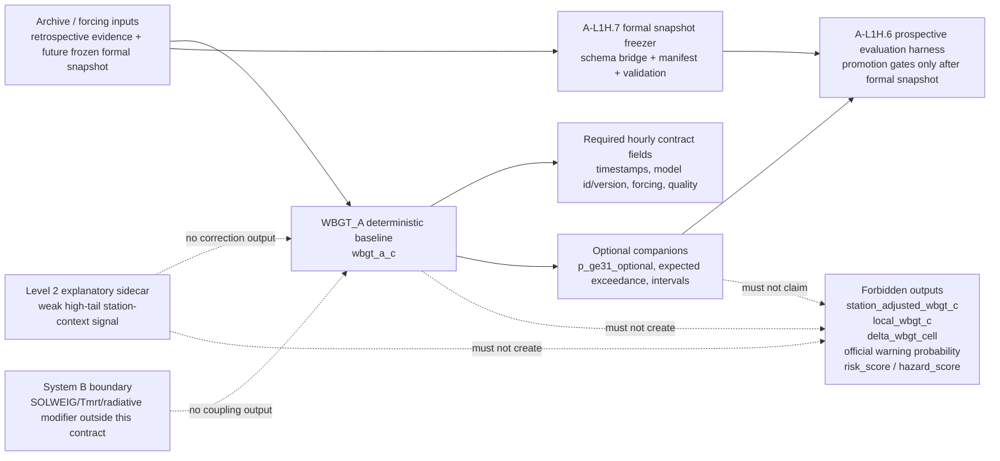

# System A Frozen Architecture Diagram

```mermaid
flowchart LR
  A["Archive / forcing inputs<br/>retrospective evidence + future frozen formal snapshot"] --> B["WBGT_A deterministic baseline<br/>wbgt_a_c"]
  B --> C["Required hourly contract fields<br/>timestamps, model id/version, forcing, quality"]
  B --> D["Optional companions<br/>p_ge31_optional, expected exceedance, intervals"]
  D --> E["A-L1H.6 prospective evaluation harness<br/>promotion gates only after formal snapshot"]
  A --> F["A-L1H.7 formal snapshot freezer<br/>schema bridge + manifest + validation"]
  F --> E
  G["Level 2 explanatory sidecar<br/>weak high-tail station-context signal"] -. "no correction output" .-> B
  H["System B boundary<br/>SOLWEIG/Tmrt/radiative modifier outside this contract"] -. "no coupling output" .-> B
  I["Forbidden outputs<br/>station_adjusted_wbgt_c<br/>local_wbgt_c<br/>delta_wbgt_cell<br/>official warning probability<br/>risk_score / hazard_score"]
  B -. "must not create" .-> I
  D -. "must not claim" .-> I
  G -. "must not create" .-> I
```
